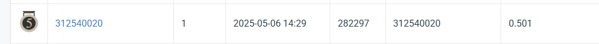

# SelectedTopic25
#ID: 312540020

## Introduction
In this work, we address the task of instance segmentation on colored medical images, aiming to segment four distinct types of cells (class1--class4). Our dataset consists of 209 training/validation images and 101 test images. To handle the small and densely packed nature of cellular structures, we adopt a modified Mask R-CNN model based on the mask_rcnn_X_101_32x8d_FPN_3x.yaml configuration.
My code is base on git detectron2: https://github.com/facebookresearch/detectron2/tree/main

## Training 
First install detectron2
```
git clone https://github.com/facebookresearch/detectron2.git
```
```
pip install -U torch==1.5 torchvision==0.6 -f https://download.pytorch.org/whl/cu101/torch_stable.html
pip install cython pyyaml==5.1
pip install -U 'git+https://github.com/cocodataset/cocoapi.git#subdirectory=PythonAPI'
pip install detectron2==0.1.3 -f https://dl.fbaipublicfiles.com/detectron2/wheels/cu101/torch1.5/index.html
```

The train.py is the best setting I submit on leaderboard.
```
python train.py --json_path data/train.json
```
## Test
To get the pred.csv and pred.json.
```
python test.py
```
## Performance Snapshot
  
